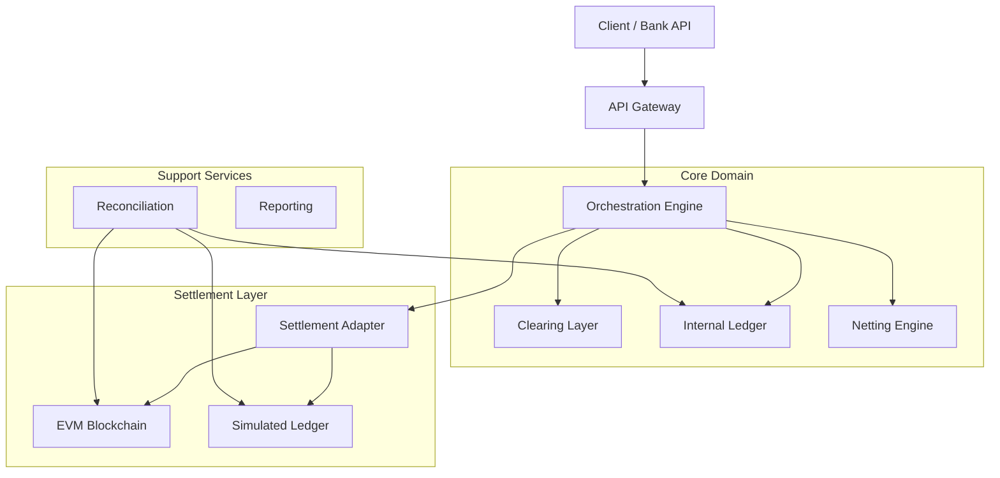

# SCSE Architecture

## System Overview

SCSE is a mock payment infrastructure that demonstrates clearing and settlement using stablecoins. It is designed with a strictly layered architecture to separate concerns between orchestration, business logic, netting, and settlement.

## Layers

### 1. Messaging & Orchestration (API + Engine)
**Responsibility**: Ingestion, authentication, workflow coordination.
- **API**: FastAPI application handling HTTP requests.
- **Engine**: Coordinates the lifecycle of a payment. It calls Clearing, Ledger, and Settlement services but contains no deep business logic itself.

### 2. Clearing Layer
**Responsibility**: Validation, compliance, and risk.
- **Schema Validation**: Ensures JSON conforms to `PaymentInstruction` schema.
- **Compliance**: Checks IVMS101 data if `amount >= threshold`.
- **Logic**: Stateless validation rules.

### 3. Ledger & Accounting
**Responsibility**: Managing participant balances and limits.
- **Ledger**: Double-entry accounting system.
- **Liquidity Check**: Ensures debtor has sufficient prefunded balance.
- **Locking**: Reserves funds upon clearing to prevent double-spend.

### 4. Netting Layer (Optional)
**Responsibility**: Batch optimization.
- **DNS Engine**: Calculates bilateral or multilateral net positions.
- **Cycle Manager**: Triggers batch processing at configured intervals.

### 5. Settlement Layer
**Responsibility**: Value transfer.
- **Adapter Pattern**: Abstract interface for settlement strategies.
- **Strategies**:
  - `SimulatedStrategy`: Updates a mock settlement DB.
  - `OnChainStrategy`: Submits ERC-20 transfers to Hardhat/local node.

## Trust Model

- **Internal Ledger**: Source of truth for *intended* state and prefunding.
- **Blockchain**: Source of truth for *final* settlement.
- **Reconciliation**: The arbiter that forces the Internal Ledger to match the Blockchain reality eventually.

## Data Boundaries

| Domain | Data Owner | Write Access |
|--------|------------|--------------|
| Application State | SCSE DB | Core Engine |
| Participant Balance | SCSE Ledger | Ledger Service |
| On-Chain Balance | Ethereum | Private Keys / Smart Contract |
