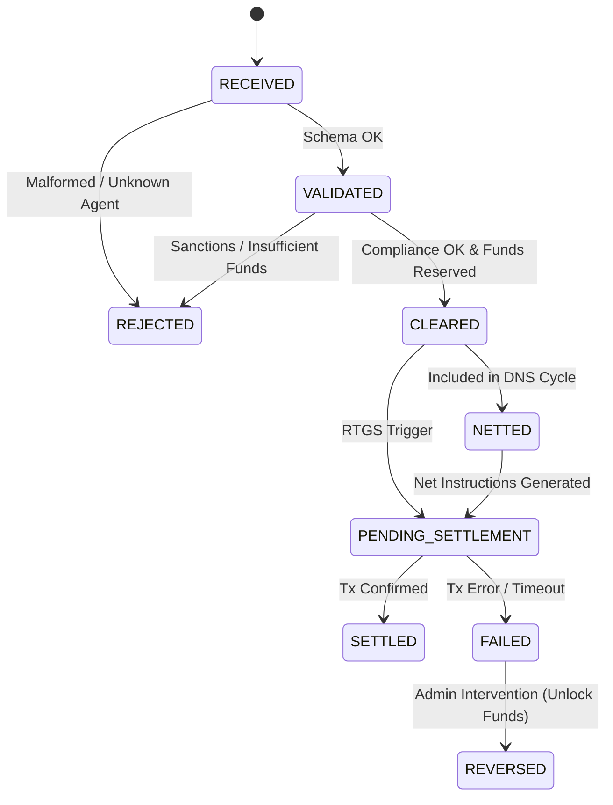

# Payment Lifecycle State Machine

The SCSE manages payments through a strict state machine to ensure data integrity and finality.

## States

| Status | Description | Owner |
| :--- | :--- | :--- |
| **RECEIVED** | Instruction received via API. Not yet validated. | API |
| **VALIDATED** | Schema compliance and participant checks passed. | Clearing Engine |
| **REJECTED** | Failed validation, compliance, or funds check. Terminal State. | Clearing Engine |
| **CLEARED** | Funds reserved in internal ledger. Ready for settlement or netting. | Ledger |
| **NETTED** | Included in a Netting Cycle. Obligation replaced by Net Settlement Instruction. | Netting Engine |
| **PENDING_SETTLEMENT** | Settlement instruction sent to chain/adapter. Awaiting confirmation. | Settlement Adapter |
| **SETTLED** | Settlement confirmed (Finality). Terminal State. | Settlement Adapter |
| **FAILED** | Settlement failed (e.g. gas issues, on-chain revert). | Settlement Adapter |
| **REVERSED** | Manual reversal of a failed payment to unlock funds. Terminal State. | Admin |

## Transitions

## Failure Codes

*   `AG01`: Unknown Agent
*   `AM04`: Insufficient Funds
*   `RR04`: Regulatory Reason (Travel Rule Missing)
*   `BE01`: System Error
